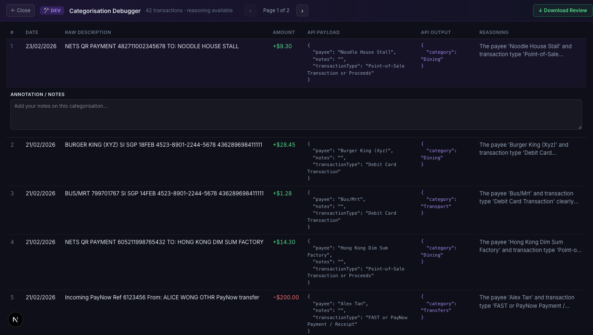

# feat: add isolated dev-tools scaffold and categorisation debugger

## Description
This PR introduces a robust, isolated development tools infrastructure and implements a new Categorisation Debugger. It establishes a multi-layered defense to ensure development files are physically excluded from production builds. Additionally, it integrates comprehensive new OpenSpec workflows and centralized rules to improve the AI agent developer experience. 

## Changes
- **Isolated Dev-Tools Scaffold**: Created a secure, internal-only `src/dev-tools` architecture (`_shell.tsx`, `_registry.ts`, `_bootstrap.tsx`) that is exclusively accessible in development environments.
- **Categorisation Debugger**: Implemented a comprehensive tool to inspect AI categorisation data payloads, review JSON outputs, debug system prompts, and export logs offline.
- **Production Build Exclusion**: Updated `next.config.ts`, `.dockerignore`, and `.vercelignore` to guarantee absolute dead-code elimination of dev-tools from production bundles.
- **OpenSpec / AI Workflows**: Added a new suite of `.agent/` skills/workflows (`/opsx-new`, `/opsx-propose`, `/opsx-verify`, etc.) and centralized rule definitions (`AGENTS.md`) to standardize AI assistant capabilities.
- **Code & Doc Cleanup**: Replaced legacy `todo.md` docs with comprehensive `dev-tools.md` architectural guidelines and OpenSpec changes.

## Related Issue
*(Please replace with linked issue # if applicable)*

## Type of Change
- [x] New feature
- [ ] Bug fix
- [x] Refactor
- [x] Documentation

## Testing
- Verified `npm run build` succeeds and completely strips out the `src/dev-tools` directory.
- Verified development environment successfully mounts the `Categorisation Debugger` dev tools shell.
- Tested the mock prompt generation and `.csv` metadata export functionality within the debugger.

## Screenshots
